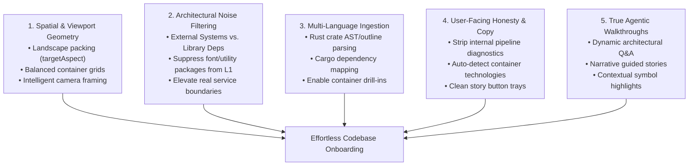

# 01. Executive Summary & Scorecard

## 1. The Core Tension: Golden Demo vs. Scanned Reality

Okie’s product promise is compelling:
> **"A spatial explanation system for software... a better way than reading code due to speed and that we have agents make it simpler to digest what is going on."**

When visiting `http://localhost:4173/` (the golden demo), that promise shines:
- The canvas feels spacious, deliberate, and readable.
- The high-level architecture is immediately graspable: an engineer understands Okie's role, its inputs, and its runtime dependencies within 10 seconds.
- Zooming in reveals neat, balanced containers with clear technologies and active-verb relationships.
- Playing the guided story takes the user on a cinematic, contextual journey down to real source lines.

When visiting `http://localhost:4173/r/THISS/okie` (the scanned dogfooding repo), that magic dissolves:
- **Disorienting Canvas**: The viewport opens on an ultra-tall "skyscraper" where 85% of the horizontal space is black void.
- **Noise Over Signal**: The user is greeted by 8 huge rectangular cards for font packages and DOM sanitizers (`@fontsource/ibm-plex-mono`, `dompurify`), each stating *"No summary supplied"*, while the actual software system (`okie`) is cut off and overlapping the canvas heading.
- **Broken Drill-down**: Clicking "Open inside" zooms the user into a vast empty void showing one corner of `@okie/web` and nothing else. Clicking "Open inside" on `atlas-engine` or any Rust crate is entirely disabled.
- **Leaked Internal Diagnostics**: The inspector banner reads `"Enrichment partial — 4 accepted (gate rejected)"` and descriptions read `"Other scopes stayed deterministic"`.
- **UI Crowding**: Five story buttons wrap into a three-tiered pile over the bottom canvas, occluding the minimap and zoom controls.
- **Unconnected Agent Experience**: "Ask Atlas" prompts for a login that visually collides with background buttons, and submitting any question merely plays a canned demo rather than answering with AI.

Instead of feeling like an intuitive architecture atlas, `/r/THISS/okie` currently feels like an unpolished raw database dump of an incomplete AST scan.

---

## 2. Experience Scorecard

| Area | Score (1-10) | Key Failure Modes |
|---|---|---|
| **First 10-Second Impression** | **3 / 10** | Canvas title overlaps cards; 8 font/utility packages dominate L1; 5 floating buttons stack in a pyramid. |
| **Spatial Layout & Aspect Ratio** | **2 / 10** | Scene is 3,930px tall by 500px wide (0.58 aspect ratio); fit-to-view leaves 85% void; drill-down lands in empty padding. |
| **Architectural Signal-to-Noise** | **4 / 10** | npm libraries treated as L1 External Systems; "Technology not specified" badges; 56 C4 advisory warnings. |
| **Multi-Language Completeness** | **3 / 10** | Zero components or symbols extracted for Rust crates; "Open inside" is disabled on 4 out of 10 containers. |
| **Guided Stories & Narrations** | **4 / 10** | Boilerplate tautological narrations ("X is a declaration in path"); camera over-zooms to black screens; repetitive button labels. |
| **Agentic Assistance ("Ask Atlas")** | **2 / 10** | Hardcoded placeholder; login modal visual overlap; no real repository Q&A or agent synthesis. |
| **Source Viewing & Evidence** | **8 / 10** | Excellent syntax-highlighted source viewer with line ranges and copy buttons, once reached. |
| **Technical Integrity & Stability** | **5 / 10** | 404 console errors on `enrichment-status.json`; leaked gate rejection strings in user copy. |

**Overall Experience Rating: 3.9 / 10** — *Critical overhaul required to achieve product-market readiness.*

---

## 3. The Five Core Pillars to Fix

To make `/r/THISS/okie` something developers eagerly reach for, five distinct pillars must be addressed:

Each pillar is examined in detail in the following sections.
