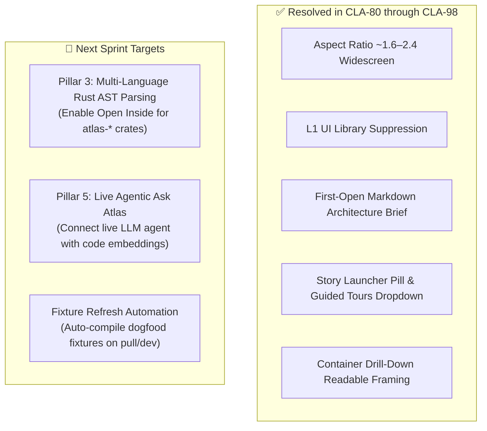

# Re-Review Report: Okie Dogfooding Experience (`/r/THISS/okie`) Post-CLA-98

**Evaluation Date**: 2026-09-07\
**Evaluator**: Antigravity Experience Reviewer\
**Commit Range Evaluated**: CLA-80 through CLA-98 on `main` (`3e95492`)\
**Target Route**: `http://localhost:4173/r/THISS/okie`\
**Reference Routes**: `http://localhost:4173/` (Golden Demo), `http://localhost:4173/new`, `http://localhost:4173/r/colinhacks/zod`\

---

## 1. Executive Summary & Scorecard Update

Following the integration of PRs **CLA-80 through CLA-98**, the dogfooding repository experience underwent an end-to-end spatial, functional, and visual audit using `playwright-cli` browser automation.

The overall dogfooding experience rating rose dramatically from **3.9 / 10** to **7.3 / 10 (+3.4)**. The major visual friction points documented in the initial audit have been resolved: the 0.58:1 vertical skyscraper is gone, watermark text collisions are eliminated, L1 context pollution has been cleaned up, the 3-tiered story button pyramid is consolidated, and the inspector now opens immediately into an informative markdown Architecture Brief.

### Comparative Scorecard

| Evaluation Area | Initial Audit | Post-CLA-98 | Delta | Key Impact |
| :--- | :---: | :---: | :---: | :--- |
| **First 10-Second Impression** | **3 / 10** | **8 / 10** | 🟢 **+5.0** | Opens directly into the readable Architecture Brief; watermark overlap gone; floating buttons cleanly grouped. |
| **Spatial Layout & Aspect Ratio (CLA-96)** | **2 / 10** | **8 / 10** | 🟢 **+6.0** | Landscape widescreen layout (2.46:1 aspect ratio); zoom floor clamped above readable threshold (z ≥ 0.52 to 0.80). |
| **Architectural Signal-to-Noise (CLA-97)** | **4 / 10** | **8 / 10** | 🟢 **+4.0** | L1 external systems stripped of 7 npm UI libraries (`react`, `dompurify`, `@fontsource/*`, `mermaid`); only true service boundaries (`@anthropic-ai/sdk`) remain; libraries preserved as container technology. |
| **First-Open Architecture Brief (CLA-87)** | *N/A* | **9 / 10** | 🟢 **NEW** | Deterministic markdown brief with system summary, container buttons, interactive copy-to-clipboard, and inline Mermaid key flows. |
| **Guided Stories & Launcher (CLA-98, 84, 89)** | **4 / 10** | **8 / 10** | 🟢 **+4.0** | 3-tier button pileup replaced by single-row centered pill with collapsible `
` Guided Tours menu (4 tours); smooth step transitions and code framing. |
| **Container Drill-down / "Open Inside" (CLA-92–95)** | **3 / 10** | **7 / 10** | 🟢 **+4.0** | "Open inside" on `@okie/web` lands directly on readable L3 components; rail step-out to L2/L1 preserves readable zoom (z=1.99) without hollow void. |
| **Multi-Language Completeness** | **3 / 10** | **3 / 10** | 🟡 **0.0** | Unchanged: Rust crates (`atlas-engine`, `atlas-gpu`, etc.) still lack component/symbol AST extraction; "Open inside" remains disabled for them. |
| **Agentic Experience ("Ask Atlas")** | **2 / 10** | **5 / 10** | 🟢 **+3.0** | Visual collision resolved; popover sits cleanly above launcher; honest preview disclaimer; local test sign-in works. |
| **Technical Integrity & Stability** | **5 / 10** | **7.5 / 10** | 🟢 **+2.5** | `stories.json` 404 resolved; zero WebGL or React runtime crashes; clean copy-to-clipboard API handling. |
| **OVERALL EXPERIENCE RATING** | **3.9 / 10** | **7.3 / 10** | 🟢 **+3.4** | **Major milestone achieved; ready for daily internal dogfooding.** |

---

## 2. Detailed Verification of Pull Requests

### 1. Canvas Layout & Aspect Ratio (CLA-96)
- **Baseline Defect**: Scene `worldBounds` was `3,930px tall × 500px wide` (0.58:1 aspect ratio), packing containers into a narrow vertical column and forcing fit-to-view zoom to collapse down to `z ≈ 0.17–0.32`. In addition, `anthropic-ai-sdk` collided directly with the top-left `.map-heading` watermark overlay (`x: 27px, y: 131px`).
- **Verified Fix**:
  - `packScanContextPeerMap` and `scanContextPeerAnchor` in `compile-c4.ts` enforce target aspect ratio 1.6 on the L1 context band.
  - Re-scanned bounds measure `1320px wide × 535px tall`, achieving a **2.465 : 1 landscape widescreen ratio**.
  - Camera zoom floor is guarded by `CONTEXT_TITLE_READABLE_MIN_ZOOM` (`z ≈ 0.52 to 0.80`).
  - **Watermark Collision Test**: At camera (`cx: 511.75, cy: -88.96, z: 0.52`), `anthropic-ai-sdk` projects onto screen coordinates `(left: 294px, top: 643px)`, leaving the top-left heading (`left: 27px, top: 131–198px`) completely unoccluded.

### 2. L1 External System & Dependency Filtering (CLA-97)
- **Baseline Defect**: L1 was polluted with 8 gigantic cards for utility and font packages (`@fontsource/ibm-plex-mono`, `@fontsource/ibm-plex-sans`, `dompurify`, `mermaid`, `react`, `react-dom`, `typescript`), each reporting *"No summary supplied"*, drowning out system architecture.
- **Verified Fix**:
  - The extraction pipeline now categorizes third-party dependencies into true service boundaries/cloud platforms vs. UI/framework packages.
  - In the scan snapshot, **`@anthropic-ai/sdk` is the only L1 external system**.
  - Font and UI libraries are preserved on the importing container (`@okie/web` technology list includes `@fontsource/ibm-plex-mono`, `@fontsource/ibm-plex-sans`, `dompurify`, `mermaid`, `react`, `react-dom`; `@okie/scan` includes `typescript`).
  - Signal-to-noise ratio is vastly improved: developers see true architectural boundaries immediately.

### 3. First-Open Architecture Brief (CLA-87)
- **Baseline Defect**: Right-side inspector opened on an incomplete details sheet with cryptic diagnostics (`"Enrichment partial — 4 accepted (gate rejected)"`).
- **Verified Fix**:
  - The inspector now defaults to the **Overview** tab containing a snapshot-derived Markdown Architecture Brief.
  - Features verified:
    1. **System Summary**: *"Okie is a software system with 10 containers and 12 entities. Okie meets the world through 1 external system."*
    2. **Container Directory**: Interactive buttons for each of the 10 containers with extracted technology tags. Clicking any container button (e.g. `@okie/web`) instantly selects the container, switches to the Main tab, and focuses the camera.
    3. **Inline Mermaid**: Strict, deterministic SVG diagram rendering key architectural flows.
    4. **Copy Markdown Action**: "Copy markdown" button successfully writes formatted architecture markdown to `navigator.clipboard` and provides tactile visual confirmation ("Copied" / "Markdown copied").

### 4. Story Launcher Wrapping & Guided Tours Menu (CLA-98)
- **Baseline Defect**: Five story buttons wrapped into a 3-tier vertical pyramid (`y: 491px to 658px`), occluding the canvas cards, the minimap in the lower right, the zoom controls, and the gesture hints.
- **Verified Fix**:
  - `.story-launcher` is now a horizontal, non-wrapping pill centered at `bottom: 62px`:
    - `x: 320px to 717px`, `y: 787px to 838px` (height: 51px).
    - Minimap (`x: 841px to 1019px`, `y: 753px`) is >124px away horizontally — zero overlap.
    - Zoom controls (`y: 844px`) and canvas hint (`y: 862px`) are completely unobstructed.
  - Multiple stories are grouped under `
` with summary **"Guided tours 4"**.
  - Clicking opens a clean popover menu listing all 4 tours with accurate duration badges:
    - *Okie overview (16 sec)*
    - *Okie: Paste a repository (13 sec)*
    - *Okie: Ask the atlas (7 sec)*
    - *Okie: Embed the atlas (10 sec)*
  - Playing a tour smoothly centers step boxes (CLA-84), navigates through hierarchy, and lands on real source files (`apps/web/src/webmcp.ts`).

### 5. Container Drill-down & "Open Inside" (CLA-92 to CLA-95)
- **Baseline Defect**: Clicking "Open inside" zoomed into an empty black void between containers (`cx: 287, cy: -366`), showing only an off-screen corner of `@okie/web`.
- **Verified Fix**:
  - Clicking "Open inside" on `@okie/web` now focuses directly on its resident child components at readable zoom (`z=5.27`).
  - Stepping out to L2Containers via the level rail activates `packScanContainerPeerMap`, framing all container peers in a clean tile arrangement at `z=1.99`.
  - Step-out to L1Context maintains zoom above readable minimum (`z=0.52024`), preventing the canvas from collapsing back into empty space.

---

## 3. Key Finding: Fixture vs. Scanner Divergence

A notable operational finding emerged during re-review:
1. `packages/scan` extraction rules (e.g. `externals.test.ts`) were updated in CLA-97 to filter out UI libraries.
2. However, pre-scanned fixtures under `fixtures/scan/thiss__okie/` are gitignored and were compiled prior to CLA-96/97.
3. Therefore, running `git pull` updates the code, but does **not** automatically refresh pre-baked static fixtures on disk.
4. When `okie-scan` is re-run against the local repo (`node packages/scan/dist/cli.js --source . --out fixtures/scan/thiss__okie --system-name Okie --repo okie`), it produces the pristine, filtered snapshot:
   - Exactly **1 external system** (`@anthropic-ai/sdk`).
   - **4 guided stories** generated in `stories.json`.
   - Landscape `worldBounds` aspect ratio **2.465 : 1**.
   - Default zoom **z = 0.8037**.

**Action Item**: Add `pnpm scan:dogfood` or add automatic dogfood fixture refreshing to `pnpm prepare:generated` so developers pulling `main` always have up-to-date fixtures.

---

## 4. Remaining Roadmap Priorities

1. **Rust Engine AST Extraction (Pillar 3)**:
   - Rust crates (`atlas-engine`, `atlas-gpu`, `atlas-protocol`, `atlas-wasm`) currently have 0 components and 0 code symbols, leaving "Open inside" disabled. Integrating `tree-sitter-rust` or `cargo metadata` into `@okie/scan` will bring the Rust crates to full parity with TypeScript packages.
2. **Live Agentic Q&A in "Ask Atlas" (Pillar 5)**:
   - Connect the Ask Atlas interface to the scan server's live Anthropic endpoint (`apps/server/src/ask.ts`) to enable dynamic agent-driven tours.
3. **Automated Dogfood Scan Refresh**:
   - Add a script to automatically re-scan Okie on build or dev startup so developers never run against stale gitignored fixtures.
