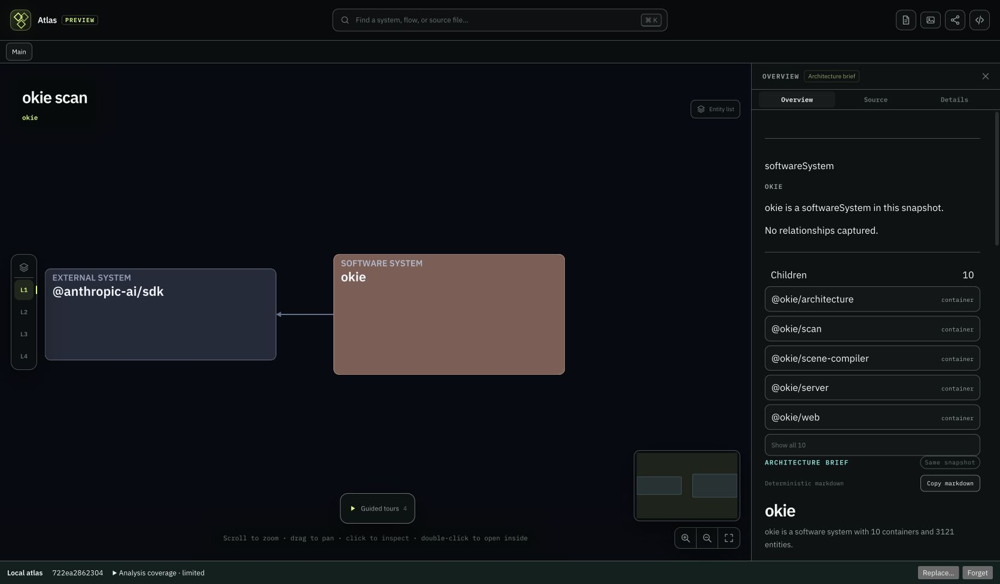

# Portable navigation recheck

2026-09-13. **Passed** in real Chrome using the rebuilt portable viewer. No product changes, native app calls, or file-picker calls. Original port 50927 and its packaged atlas were untouched.

QA-only CLI export: `/tmp/okie-portable-static/qa-navigation`, served at `http://127.0.0.1:50928/qa-navigation/` by a loopback Python static server.

1. Exported the actual smoke artifact (`portable-cli-smoke`, revision `272a0322a954`). Clicked its container in the inspector and Zoom in. Captured a deep link with selection `container:portable-cli-smoke`, camera `cx=1076.579`, `cy=321.146`, `z=1.40483`, and system lens.
2. Reloaded that same snapshot. The complete URL remained exactly unchanged, including selection, camera, root, and lens. The inspector still described the selected container and its `src/index.ts` child.
3. Moved that QA export aside and used the CLI to export the actual Okie artifact at the exact same path. Reloaded the existing smoke deep link.
4. The viewer reset the mismatched navigation: repo/snapshot became Okie `722ea2862304`, root became `system:okie`, obsolete selection/lens disappeared, and camera reset to `cx=-393.525`, `cy=-452.338`, `z=0.8037`.
5. Visually confirmed both Okie and `@anthropic-ai/sdk` nodes visible with their edge, populated minimap, and nonblank Okie inspector reporting 3121 entities. The stale-camera problem observed in the earlier persistence pass is resolved.

